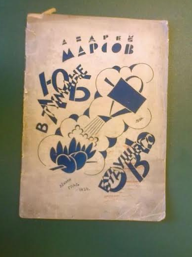

# Любовь в Тумане Будущего: История Одного Романа в 4560 Году

## Overview

[Любовь в Тумане Будущего: История Одного Романа в 4560 Году](https://ru.wikipedia.org/wiki/%D0%9B%D1%8E%D0%B1%D0%BE%D0%B2%D1%8C_%D0%B2_%D1%82%D1%83%D0%BC%D0%B0%D0%BD%D0%B5_%D0%B1%D1%83%D0%B4%D1%83%D1%89%D0%B5%D0%B3%D0%BE) (English: [Love in the Fog of the Future: The Story of a Romance in the Year 4560](https://en.wikipedia.org/wiki/Love_in_the_Fog_of_the_Future)) is the only known novel by Russian author Andrei Marsov. This repository contains the original Russian text transcribed directly from a copy of the novel held in the [Russian National Library](http://nlr.ru/) in Saint Petersburg, Russia as well as an English translation.

After reading my favorite novel [1984](https://en.wikipedia.org/wiki/Nineteen_Eighty-Four) by George Orwell one too many times, I sought to find something similar. Having already read [Brave New World](https://en.wikipedia.org/wiki/Brave_New_World) and others, I came across an article where George Orwell described the Russian novel [Мы](https://ru.wikipedia.org/wiki/%D0%9C%D1%8B_(%D1%80%D0%BE%D0%BC%D0%B0%D0%BD)) (English: [We](https://en.wikipedia.org/wiki/We_(novel))) by Yevgeny Zamyatin as one of his primary influences and inspirations for the dystopian world of 1984. Reading into the inspiration for Zamyatin's We, I came across the mention of this novel. Written in 1921, this masterpiece remained unpublished until 1924.

Despite my best efforts to find a digital copy to consume, I came up empty-handed. Attempts to find a hard copy of the novel proved equally fruitless. I was advised to consult the tomes of the National Library where perhaps some extent copy existed. To my luck, I was able to visit the library and copy the contents of the novel directly.

This repository is the result. My hope is that others who travel a similar literary path find this transcription and translation with far less effort than that which was required to create them.

Upon completion this document will be donated to the library so that future readers can access a digital transcription or translation directly from the library. The text will also be hosted here for those unable to journey to Russia.

## Status

Language | Complete
--|:--:
Russian | :x:
English | :x:
